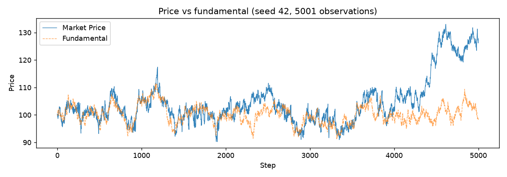
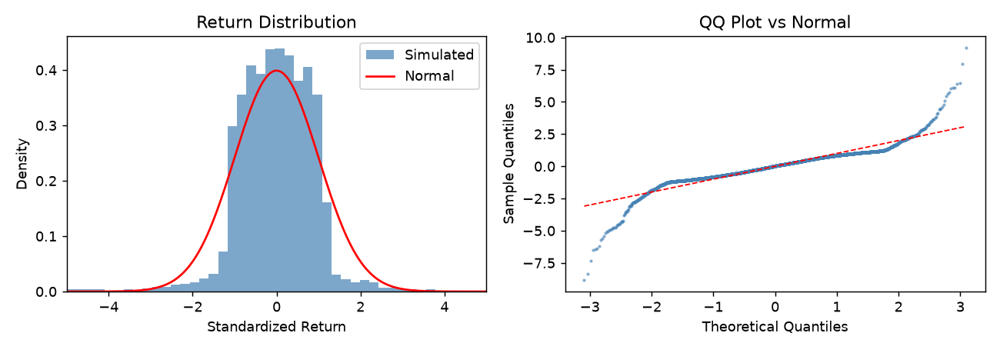

# Market ABM

[](https://github.com/sarpvulas/AgentBasedProject/actions/workflows/tests.yml)
[](LICENSE)

A heterogeneous agent-based model of a financial market with a limit order book, built in Python for the King's College London agent-based modelling course (MSc Computational Finance).

## TL;DR

Real prices show fat-tailed returns and clustered volatility, and simple models with one kind of trader usually do not. This repo simulates 100 noise, fundamental and trend-following traders who trade one asset through a continuous double auction, so the price comes out of order matching rather than being assumed. With the default parameters the simulated returns are strongly fat-tailed (excess kurtosis about 11 on seed 42, 12.6 on average over 30 seeds) and show weak volatility clustering, but they also show a negative lag-1 autocorrelation, so not every stylized fact is reproduced (see Results and Limitations).



## Results

Default parameters, 5,000 steps, seed 42 (`python scripts/make_figures.py` prints these):

| Statistic | Seed 42 | 30 seeds (1-30): mean, min to max |
|---|---|---|
| Excess kurtosis of per-step log returns | 10.9 | 12.6, 8.6 to 18.8 |
| ACF of returns, lag 1 | -0.092 | -0.071, -0.096 to -0.043 |
| ACF of squared returns, lag 1 | 0.172 | 0.068, 0.024 to 0.178 |
| Hill tail index (top 5% of abs returns) | 2.09 | 2.08, 1.80 to 2.37 |

What this shows:

- Fat tails: yes. Excess kurtosis is positive and large in all 30 seeds. The QQ plot below shows the excess comes from the tails; the centre of the distribution is flatter than normal.
- Volatility clustering: present but short-lived. ACF of squared returns is positive in all 30 seeds, decaying from 0.17 at lag 1 to 0.01 at lag 5 for seed 42.
- No return autocorrelation: not reproduced. Lag-1 ACF is negative and outside the 95% band (about 0.028) in all 30 seeds, which is typical of bid-ask bounce in a book model. The built-in `no_return_autocorrelation` check passes anyway because it tests the mean of |ACF| over lags 1-5 against 3 times the band, a loose criterion.
- Hill index around 2 is at the low end of the 2 to 5 range the code treats as plausible, using a 5% tail on only 5,000 observations; treat it as indicative.
- The price drifts well away from the fundamental in the last 1,500 steps of seed 42 (top figure); the fundamentalist agents correct it only slowly.



## Model

Each step:

1. The fundamental value follows an Ornstein-Uhlenbeck process, `F(t+1) = F(t) + kappa (mu - F(t)) + sigma eps`.
2. Agents are shuffled and act one at a time. Each submits at most one order of size 1 (market or limit) or holds.
3. Matching is top-of-book: a market order, or a limit order that crosses the spread, trades against the best resting order at the resting price. Other limit orders rest, sorted by price then arrival step.
4. A trade settles immediately in cash and inventory. If either side cannot cover it (the resting order is stale), the trade is voided and does not set the price or count as volume.
5. Resting limit orders older than `stale_order_age` steps are cancelled.

| Agent | Rule |
|---|---|
| Noise | Buys 30%, sells 30%, holds 40%. Half market orders; half limit orders priced around the last price with jitter up to one spread. |
| Fundamental | Trades toward the fundamental with probability `min(abs(mispricing) * fundamental_sensitivity, 1)`; mostly limit orders priced between price and fundamental. |
| Trend | Acts when the last return exceeds `trend_threshold`, with probability scaled by `trend_sensitivity`; mostly market orders in the direction of the move. |

Agents start with 10,000 cash and 10 units, and cannot buy without cash or sell without inventory. The price is the last trade price.

```
market_abm/
  agents.py          noise, fundamental, trend-following agents
  order_book.py      limit order book, price-time priority
  fundamental.py     Ornstein-Uhlenbeck fundamental value
  model.py           AgentPy model wiring agents + book
  analytics.py       return statistics, stylized-facts checks, multi-seed runs
  visualization.py   Matplotlib charts
  config.py          default parameters
app.py               Streamlit dashboard (simulation + guide tabs)
notebooks/           single run, parameter sweep, stylized facts, sensitivity, perturbation
scripts/make_figures.py   regenerates docs/img and prints the table above
tests/               pytest suite
```

Stack: Python 3.12, AgentPy, NumPy, pandas, SciPy, statsmodels, Matplotlib, Streamlit.

## Quickstart

```bash
pip install -r requirements.txt
streamlit run app.py          # dashboard
pytest tests/ -q              # tests
python scripts/make_figures.py
```

The dashboard has a Simulation tab (parameters, price charts, return distribution, autocorrelation, PnL by strategy, stylized-facts checks) and a Guide tab explaining each parameter and chart.

## Parameters

Defaults from `market_abm/config.py`:

| Parameter | Description | Default |
|---|---|---|
| `steps` | Simulation length | 5000 |
| `seed` | Random seed | 42 |
| `n_agents` | Total number of traders | 100 |
| `frac_fundamental` | Share of fundamental traders | 0.33 |
| `frac_trend` | Share of trend followers (rest are noise) | 0.33 |
| `initial_cash` / `initial_inventory` | Starting endowment per agent | 10000 / 10 |
| `fundamental_initial`, `mu` | Starting and long-run fundamental value | 100 |
| `kappa` | Mean reversion speed | 0.01 |
| `fundamental_sigma` | Fundamental shock volatility | 0.5 |
| `fundamental_sensitivity` | Fundamental trader reaction to mispricing | 2.0 |
| `trend_threshold` | Minimum fractional return for a trend signal | 0.005 |
| `trend_sensitivity` | Trend trader reaction to return size | 5.0 |
| `stale_order_age` | Steps before a resting order is cancelled | 10 |

## Reproducibility

- One seed (`seed`, default 42) drives a single NumPy `Generator` used for the fundamental, agent types, arrival order and all agent decisions. The same seed and parameters give identical price paths (covered by `test_same_seed_same_prices`).
- Results above were produced with AgentPy 0.1.5, NumPy 2.5.3, pandas 3.0.6, SciPy 1.18.1 and statsmodels 0.15.0 on Python 3.12. `requirements.txt` only gives lower bounds, so other versions may differ.
- The 30-seed numbers use seeds 1 to 30 with default parameters.

## Limitations

- One asset, one unit per order, top-of-book matching only. There are no partial fills or multi-level sweeps, and the `quantity` field of an order is ignored.
- Agents can trade with their own resting orders (0.65% of trades on seed 42), which counts as volume without changing wealth.
- Returns are lumpy: the histogram shows a flat-topped centre with a few large jumps, so kurtosis is driven by the tails rather than a peaked centre.
- `run_experiment` drops zero returns before computing statistics; this changes the numbers very little (kurtosis 10.84 vs 10.90 on seed 42) but is not the same series as the one the dashboard plots.
- No calibration to real market data; the "plausible range" checks are rules of thumb, not tests against data.
- Tests cover the order book, agents, fundamental process, analytics and a model smoke/invariant run; they do not test the stylized-fact outputs statistically.

## Credits and license

Built for the King's College London agent-based modelling course (MSc Computational Finance) by Sarp Vulaş (Dubai). MIT license, see [LICENSE](LICENSE).
